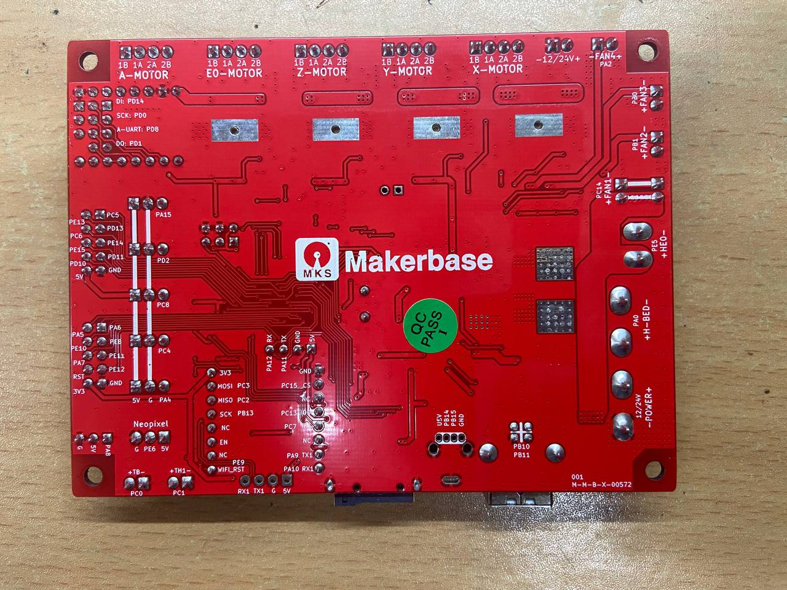
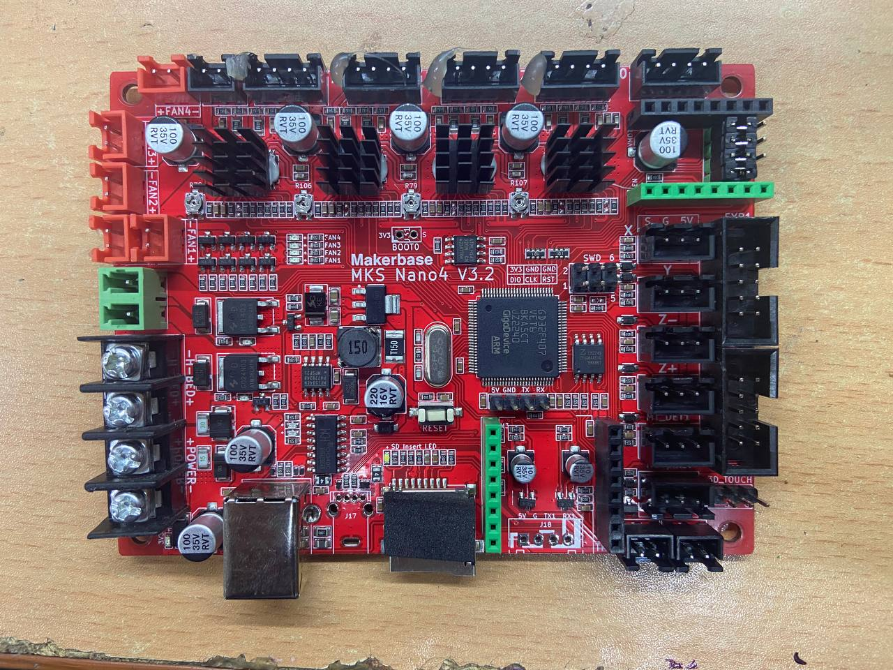
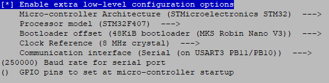

# Makerbase MKS Nano 4 v3.2
Makerbase MKS Nano4 v3.2 board for klipper

## Общий вид платы `v3.2`:

## Конфигурация

# Особенности платы
> Нету переключателя `USB power` как на версии `v3.1`, поэтому питание на плату может подаваться от компьютера! Придется резать `+5v` на кабеле.

> Стоит `CH340C` микросхема, которая не имеет id, поэтому определяться в `/dev/serial/by-id/` не будет! Прописывать в `printer.cfg` можно будет только принудительный путь до физического USB порта через `/dev/serial/by-path/`. При смене порта или принтера с такой же платой - klipper этого не распознает!

> Микропроцессор `GD32F407` как минимум не имеет датчика температуры (или выполнен коряво) и при запуске клиппер будет выдавать ошибку деления на ноль (float divizion by zero)! Закоментировать `[temperature_sensor mcu_temp]` секцию.

Актуальность информации: август 2023 год.
